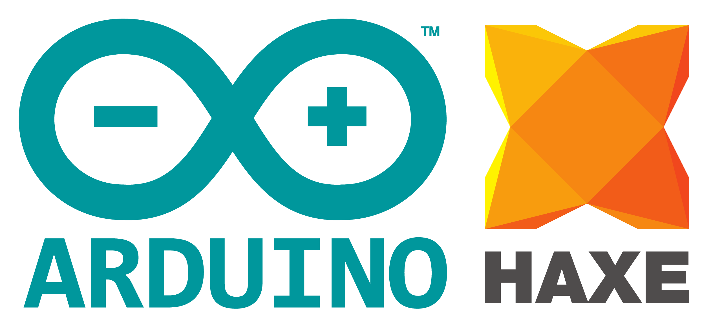

# hxArduino

What happens when you combine [Haxe](https://haxe.org/) with [Arduino](https://www.arduino.cc/)?

Haxe has the ability to transpile to cpp, so it's in the realm of posiblities.

Ian Harrigan, a freelance software engineer and creator of [haxeui](http://haxeui.org/) asked the same question.

It was an itch that needed to be scratched. And voila! it's possible!

**this project is in its early stages (WIP), be patient!**

Or as Ian put it

> NOTE: im in the process of rewriting the generator to make MUCH nicer output c++, basic GC (auto pointers), etc, etc - so far seems to be working nicely! Stay tuned!!

* Includes basic Arduino externs (`Arduino`, `LiquidCrystal`, `MemoryFree`, custom haxe "bits" like haxe_Log::trace - see: `/lib`)
* Custom C++ generator
* [Messy] "compiler" .hx class to compile build / link generated c++
* Ability to push to Arduino device (hardcoded to COM3 - needs to change!)
* Ability to start reading from serial com port via hxSerial for program traces (hardcoded to COM3 - needs to change!)

Follow Ian Harrigan on:

- [twitter](https://twitter.com/IanHarrigan1982)
- [github](https://github.com/ianharrigan)