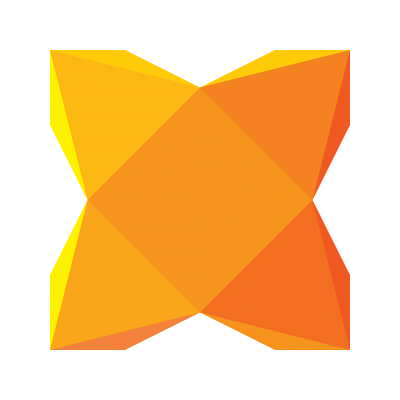

# What is Haxe?

Lets get the Wikipedia description first:

> Haxe is an open source high-level multi-platform programming language and compiler that can produce applications and source code for many different platforms from a single code-base.
>
> Haxe includes a set of common functionality that is supported across all platforms, such as numeric data types, text, arrays, binary and some common file formats. Haxe also includes platform-specific API for Adobe Flash, C++, PHP and other languages.
>
> Code written in the Haxe language can be source-to-source compiled into ActionScript 3 code, JavaScript programs, Java, C# , C++ standalone applications, Python, PHP, Apache CGI, and Node.js server-side applications.

*From [wikipedia](https://en.wikipedia.org/wiki/Haxe)*

----

And the official description:

> Haxe consists of a high-level, open source programming language and a compiler. It allows compilation of programs, written using an ECMAScript-oriented syntax, to multiple target languages. Employing proper abstraction, it is possible to maintain a single code-base which compiles to multiple targets.
>
> Haxe is strongly typed but the typing system can be subverted where required. Utilizing type information, the Haxe type system can detect errors at compile-time which would only be noticeable at run-time in the target language. Furthermore, type information can be used by the target generators to generate optimized and robust code.

*From [haxe.org - manual](http://haxe.org/manual/introduction-what-is-haxe.html)*

-----

## History

A long time ago, there was MTASC, the ActionScript 2 compiler which brought Flash to the entreprise,
and its author, [Nicolas Cannasse](https://twitter.com/ncannasse), decided to create a new open-source
language inspired by ActionScript and ML languages like Ocaml: Haxe.

Around 2006, Haxe was born, designed to be adapted to a wide variety of targets, including Flash and JavaScript.

## Early users

It was already the most modern compile-to-JS language, but of course a big focus from the author's company
was games, and likewise the initial community using Haxe was certainly oriented into gaming more than web apps.

Quickly small companies and indie developers wanted to just code everything with Haxe: PHP on the server,
JS for the web interactions, Flash for games, then C++ to look for more performance and freedom in games.

NME and OpenFl appeared as the first big efforts to reproduce the Flash API for desktop and mobile - people
have started, abusively, assimilating OpenFl with Haxe, while it was just one library among many.

## The raise of JavaScript

JavaScript has taken the world by storm now; people use it for increasingly complex browser apps, but also
for command line and server applications, and even more recently for native apps using react-native.

Following this trend, users of Haxe-JavaScript have also grown and keep up with the state of the art,
and Haxe developers believe it's a better language for small to huge JavaScript projects.

A popular language like TypeScript, which appeared much later than Haxe and recently gained a large
following thanks to being closer to ES6 and backed by big corporations, shows that typed languages
are a concern which appeals to JavaScript developers. And while TypeScript is a decent language, it
essentially has the same pros and cons as regular JavaScript and compilation is several orders of
magnitude slower than Haxe for large projects.

This documentation will hopefully demonstrate how easy it is to use Haxe for JavaScript development. It
may not look as easy as other compile-to-JS to get started but it really doesn't require a big investment
to become familiar with it - and it will make you a better programmer.

---
